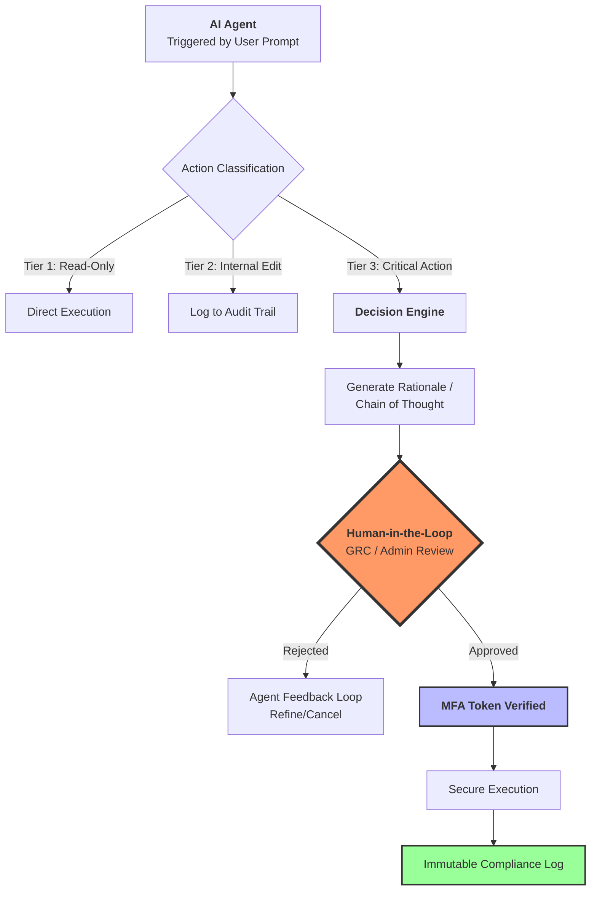

```mermaid
graph TD
    A[<b>AI Agent</b><br/>Triggered by User Prompt] --> B{Action Classification}
    
    B -- Tier 1: Read-Only --> C[Direct Execution]
    B -- Tier 2: Internal Edit --> D[Log to Audit Trail]
    B -- Tier 3: Critical Action --> E[<b>Decision Engine</b>]
    
    E --> F[Generate Rationale /<br/>Chain of Thought]
    F --> G{<b>Human-in-the-Loop</b><br/>GRC / Admin Review}
    
    G -- Rejected --> H[Agent Feedback Loop<br/>Refine/Cancel]
    G -- Approved --> I[<b>MFA Token Verified</b>]
    
    I --> J[Secure Execution]
    J --> K[Immutable Compliance Log]
    
    style G fill:#f96,stroke:#333,stroke-width:4px
    style I fill:#bbf,stroke:#333,stroke-width:2px
    style K fill:#9f9,stroke:#333,stroke-width:2px
```
